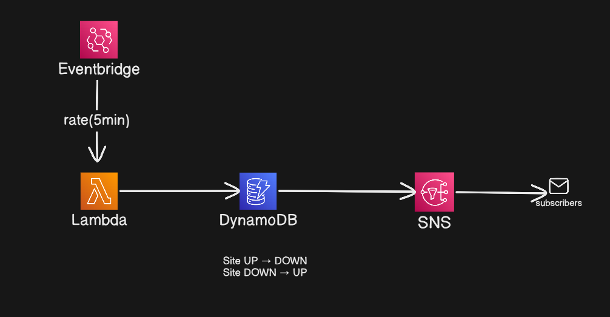

# Serverless Website Monitor

A lightweight, serverless monitoring stack that checks website uptime, latency, and SSL certificate expiry on a schedule, then sends alerts via SNS (email/SMS).

## Features
- **HTTP uptime & latency checks** (per-site threshold)
- **SSL expiry warnings** (30-day and 3-day alerts)
- **State tracking** in DynamoDB to detect up/down transitions
- **Alerts** via SNS (email + optional SMS)
- **Scheduled runs** using EventBridge

## Architecture


- **Lambda** runs checks on a schedule
- **DynamoDB** stores last known state per site
- **SNS** sends alerts
- **EventBridge** triggers the Lambda

## Prerequisites
- AWS account
- AWS CLI configured locally
- Python 3.12 (for local testing)

## Configuration
Update the monitored targets in [src/sites.json](src/sites.json):

```json
[
  {
    "site": "Main Website",
    "url": "https://example.com",
    "domain": "example.com",
    "latency_threshold_ms": 2000
  }
]
```

## Deploy (CloudFormation)
This repo ships a CloudFormation template in [infra/template.yaml](infra/template.yaml).

1) Package Lambda code (zip the `src` folder contents, not the folder itself).
2) Upload the zip to S3.
3) Deploy the stack.

Example (replace values as needed):

```bash
# 1) Create a zip with the Lambda code
cd src
zip -r ../monitor.zip .

# 2) Upload to S3
aws s3 cp ../monitor.zip s3://YOUR_BUCKET/monitor.zip

# 3) Deploy
aws cloudformation deploy \
  --template-file ../infra/template.yaml \
  --stack-name website-monitor \
  --capabilities CAPABILITY_NAMED_IAM \
  --parameter-overrides \
      StackPrefix=website-monitor \
      AlertEmail=you@example.com \
      AlertPhoneNumber="" \
      ScheduleRate="rate(5 minutes)"
```

> Note: The template currently includes a placeholder inline Lambda. After deployment, update the Lambda code to use your uploaded zip (Console or `aws lambda update-function-code`).

## Environment variables
The template sets these for the Lambda:
- `DDB_TABLE` — DynamoDB table name
- `SNS_TOPIC_ARN` — SNS topic ARN

## Local testing (optional)
You can run checks locally for quick validation:

```bash
cd src
python -c "from handler import lambda_handler; print(lambda_handler({}, None))"
```

> Local runs will fail if AWS credentials are missing, because DynamoDB/SNS are used for state and alerts.

## Files
- [src/handler.py](src/handler.py) — Lambda entry point
- [src/http_check.py](src/http_check.py) — HTTP uptime/latency check
- [src/ssl_check.py](src/ssl_check.py) — SSL expiry check
- [src/state.py](src/state.py) — DynamoDB state storage
- [src/alert.py](src/alert.py) — SNS alert sender
- [infra/template.yaml](infra/template.yaml) — CloudFormation stack

